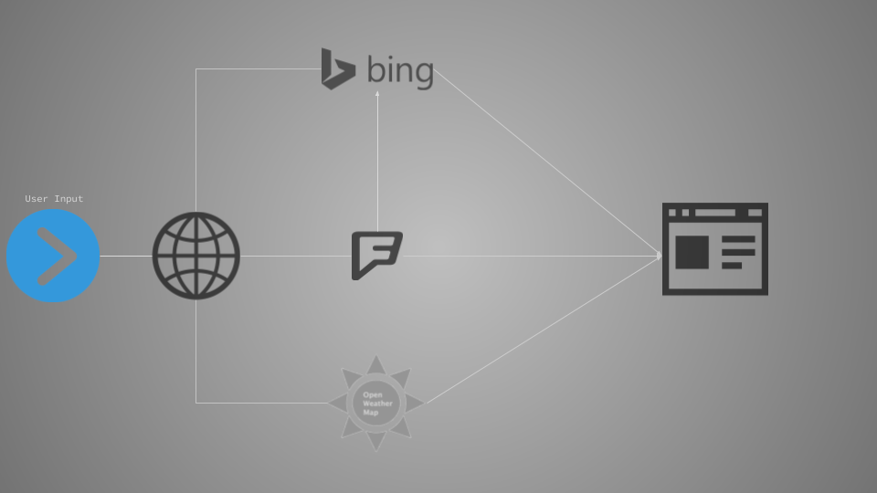

# //doSomething
This page was a collaborative project for the U of O full stack bootcamp.

The application uses Bing's geocoding service to resolve a user provided location query to latitude/longitude and then calls the FourSquare API for a list of recommended venues.

Once that call resolves, the Bing Maps service is called to create pins for the venues, using icons from the FourSquare response

A listener is attached to each pin that will make another call to FourSquare for more details about that venue.

## Technologies used
* Bing Maps V8 Web Control
* Bing maps geocoding API
* Foursquare API
* OpenWeatherMap API
* jQuery
* Bootstrap 4

